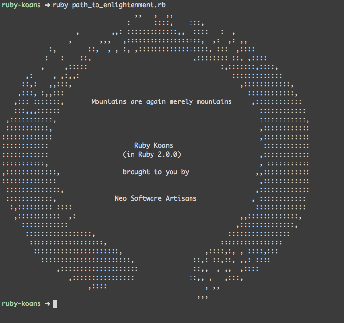

# Ruby Koans

This is my path through [Ruby Koans](http://rubykoans.com/).

I reached 100% on 03-02-2015 (yay!). It was a great learning experience and I would
recommend it to anyone interested in learning about Ruby.

See the [GitHub project](https://github.com/neo/ruby_koans) for more.

To run the tests:

        ruby path_to_enlightenment.rb
